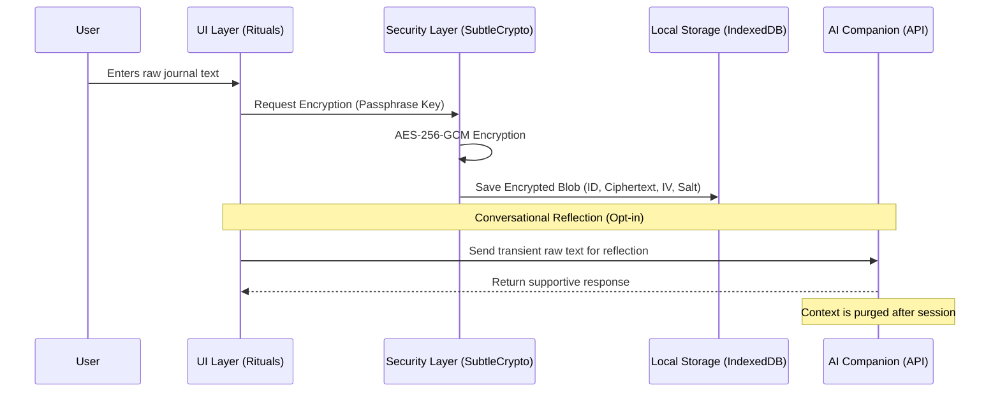

# Mindspace

**Mindspace** is a private-first journaling platform that leverages AI to act as an empathetic mirror for personal growth. It is built as a "Zero-Knowledge" system, ensuring that data sovereignty and user trust are non-negotiable.

---

## 1. Design Overview
Mindspace bridges the gap between logging and growth. Key targets include:
* **The "Blank Page" Friction**: Replacing empty editors with step-based writing rituals.
* **"Archive Blindness"**: Using AI to surface patterns that would otherwise be buried in text.
* **The Trust Gap**: Ensuring that personal narratives remain 100% private through on-device encryption.

---

## 2. Getting Started

### Prerequisites
* **Node.js**: v18 or higher.
* **OpenAI API Key**: (Optional) For conversational reflection and recall.

### Installation
1. Clone the repository.
2. Install dependencies:
   ```bash
   yarn install
   ```
3. Set up environment variables (if using AI features):
   * Create a `.env` file.
   * Add `OPENAI_API_KEY=your_key_here`.

### Running Locally
Run the development server:
```bash
yarn dev
```
Open [http://localhost:3000](http://localhost:3000) to view the application.

---

## 3. Technology Stack
* **Framework**: Next.js 15 (App Router) + TypeScript.
* **Storage**: **IndexedDB** for structured, local storage (via `idb` library).
* **Security**: Web Crypto API (SubtleCrypto) for hardware-accelerated encryption.
* **Integrity**: Zod for schema enforcement, ensuring AI responses and backups are valid.

---

## 4. Deployment & Test Access
*   **Live Demo URL**: [Mindspace](https://mind-space-al3aqh6f4-devanshipatel18s-projects.vercel.app/))

### 4.1 Testing Analytics with Seeded History
To see the **Insights Dashboard** and **Journal Recall** in action without writing weeks of data manually:
1.  **Unlock** the application with a passphrase of your choice.
2.  Navigate to `/scripts/seed`.
3.  Click **"Seed static demo data"** or **"Generate unique history with AI"**.
4.  This will populate your local IndexedDB with encrypted history using *your* current device salt and passphrase.
5.  Go to the **Archive** or **Insights** page to see the results.

---

## 5. Data Flow & Security Model

### 5.1 Zero-Knowledge Data Flow
The following diagram illustrates how Mindspace ensures that raw text never touches the persistent storage layer or the network in an unencrypted state.



### 5.2 Threat Model & Mitigation
| Threat | Mitigation Strategy |
| :--- | :--- |
| **Server/Cloud Compromise** | **Neutralized**: There is no server. Data exfiltration from a central database is impossible. |
| **Network Sniffing** | **Mitigated**: Data is encrypted *before* any possible sync. Raw text only moves to the LLM over HTTPS. |
| **Device Theft (Physical)** | **Hardened**: Data is encrypted at rest via AES-256. Without the passphrase, the files are statistically impossible to crack. |
| **Memory Scraping** | **Mitigated**: Session keys are ephemeral and stored only in volatile memory, cleared upon browser close or lock. |

---

## 6. Design Principles

### 6.1 Trust First
* **Local-First Reality**: All journal data is encrypted and stored locally.
* **Zero-Trace**: No cloud storage, no accounts, and zero silent analytics.
* **Sovereign AI**: AI features are optional and strictly controlled by the user.

### 6.2 Human-Centered AI
* **The Mirror, Not the Doctor**: AI reflects user thoughts without diagnosing or medicalizing.
* **Socratic Inquiry**: AI focuses on asking gentle questions rather than drawing conclusions.
* **Label-Free Zone**: AI never labels the user or attempts to categorize mental states into clinical terms.

### 6.3 Minimal Cognitive Load
* **Structured Flow**: Short, step-based rituals eliminate "Blank Page" anxiety.
* **Intent Selection**: The system requires selecting a path (Unload, Make Sense) before writing.
* **Passive Insights**: Emotional patterns are available for review but never forced upon the user.

### 6.4 Progressive Insight
* **Opt-In Context**: The architecture allows users to decide exactly which data (like "Memories") is used for AI reflection.
* **Chosen Signals**: Patterns emerge from signals the user chooses to track, not automated "mind-reading" inferences.

---

## 7. System Architecture

### 7.1 High-Level Diagram
```text
Browser Sandbox
 ├─ UI Layer (Next.js + Tailwind)
 ├─ Security Layer (Web Crypto API + PBKDF2)
 ├─ Local Storage Layer (IndexedDB via idb)
 ├─ AI Companion (Optional, Edge API-based)
 └─ Insights Engine (On-device tag aggregation)
```

**Architectural Philosophy**: There is **no backend** in the MVP by design. The infrastructure assumes the environment is a client-side execution sandbox where the user holds 100% of the keys.

---

## 8. Core Functional Modules

### Module 1: The Secure Vault (Zero-Knowledge)
* **Passphrase-Derived Keys**: All content is encrypted client-side using **AES-256-GCM**. The encryption key is derived from a user passphrase via **PBKDF2 (600,000 iterations)**. 
* **Ephemeral Memory**: The session key exists only in volatile active memory (`sessionStorage` / React state) and is never persisted to disk or transmitted to any server.
* **Auto-Lock Logic**: The vault is designed to "de-authenticate" automatically after periods of inactivity, purging the temporary session key from memory.

### Module 2: Intent-Based Rituals
* **Guided State Machine**: The system offers structured flows: **Unload** (Venting), **Make Sense** (Problem Solving), or **Help Write** (Prompts). 
* **Paced Self-Reflection**: Rituals are divided into steps to slow down thinking and encourage deeper introspection before the AI provides feedback.

### Module 3: Real-Time AI Mirroring
* **Supportive Observer**: As ritual steps are completed, the AI provides a brief reflection. 
* **Tentative Language Guardrails**: The AI is programmed to use "mirroring" language (e.g., *"It seems like..."* or *"I'm hearing that..."*) ensuring it does not diagnose or assume authority over the user's narrative.
* **On-the-Fly Context**: The AI only processes the currently active ritual steps; it has no access to the full historical vault unless explicitly requested via Recall.

### Module 4: Archive & Entry Review
* **Decryption-on-Demand**: The archive view lists high-level metadata (Ritual Name, Date) but only decrypts the full body text when an entry is explicitly opened by the user.
* **Locked-Entry Awareness**: If entries are found that cannot be decrypted with the current session key (e.g., after a passphrase change), the UI monitors and flags these as "Locked" rather than showing empty data.

### Module 5: User-Curated "Memories"
* **Selective Retrieval**: Specific sentences or insights can be explicitly "pinned" as permanent Memories.
* **Long-Term Growth Context**: These Memories serve as a compressed, persistent context for the AI, allowing it to "recall" important life lessons without processing every raw journal line.

### Module 6: On-Device Analysis Engine
* **Metadata-Only Processing**: Tags (Emotion/Context) are aggregated locally in memory using `lib/stats.ts`. 
* **Privacy-Preserving Dashboard**: The engine counts frequencies and pairings of tags. Because this happens 100% on-device, the dashboard provides the experience of a synchronized application while maintaining a strict zero-knowledge boundary.

### Module 7: Portable Data (Backup & Migration)
* **Content-Blind Handling**: The system manages **encrypted blobs** (ciphertext + IV) during import/export. The import logic requires no access to raw text.
* **Integrity Validation**: During import, the application performs a "dry-run" decryption of a sample entry. If it fails, the UI alerts the user of a **Passphrase Mismatch**, preventing "ghost entries" that cannot be read.
* **Merge vs. Replace**: The system supports merging new backups with existing local data while automatically skipping duplicate entry IDs.

### Module 8: Secure Settings & Customization
* **AI Key Isolation**: API keys are provided by the user. These are stored separately from journal entries and can be optionally encrypted with the journal passphrase.
* **Differential Privacy Control**: Specific insights or AI features can be toggled off at any time.

### Module 9: Journal Recall
* **Purpose**: Allows querying past narratives in natural language.
* **Implementation Logic**: The application performs a "Just-In-Time" (JIT) decryption of relevant entries into a temporary in-memory session. This context is then used to ground the LLM's response.
* **Caveat**: To maintain privacy, only the last 50 entries are currently shared. This is a temporary measure that will be updated in the future.

---

## 9. Technical Limitations

In keeping with the **Trust-First** philosophy, Mindspace accepts several technical trade-offs that are important for evaluators to consider:

*   **No Passphrase Recovery**: As a 100% Zero-Knowledge system, there is no "Forgot Passphrase" function. Loss of the passphrase results in total loss of data access.
*   **Browser-Bound Persistence**: Data is stored in **IndexedDB**. If browser data is cleared or the cache is hard reset, the local vault will be deleted. Users must manage their own backups via the Portable Data module.
*   **Transient AI Processing**: While entries are stored encrypted, the raw text must be decrypted and sent to the LLM provider (e.g., OpenAI) for reflection and recall. This is why the AI is treated as an opt-in companion.
*   **Local Compute Limits**: On-device insights and RAG retrieval are limited by the browser's allocated memory and CPU. These features are optimized for performance but lack the brute-force speed of a cloud-centralized database.

---

## 10. Future Growth Roadmap

### 10.1 Feature Enhancements
* **Narrative Pattern Stories**: Moving away from "charts" toward human-readable stories like: *"Boundaries often correlate with feelings of capability, whereas late-night work logs precede feelings of unsettlement."*
* **Precision Tagging**: A gentle system to help name emotions more accurately (e.g., suggesting *"overwhelmed"* instead of just *"stressed"*).
* **Turning-Point Checkpoints**: The ability to mark entries as important "Life Checkpoint" lessons that the AI can gently resurface later.
* **Multi-Layered Persona Isolation**: Leveraging the Zero-Knowledge architecture to allow a single local vault to host multiple independent journal layers. By utilizing different passphrases, users can seamlessly toggle between isolated "personas" (e.g., *Private Personal*, *Work Reflection*, *Therapeutic Journal*), ensuring that each layer remains cryptographically invisible to the others within the same database.

### 10.2 Technical Enhancements
* **Offline Global-LLM (WebLLM)**: Moving the AI core entirely on-device (zero network requests) to ensure absolute data sovereignty.
* **Encrypted SQLite Virtual Vaults**: Transitioning to a virtualized SQLite engine (SQL.js) with page-level encryption for complex relational queries.
* **Hardware-Bound Vaults**: Using the **Secure Enclave (WebAuthn/FIDO2)** to bind encryption keys to the physical TPM chip.
* **Local-Only Vector Search (WASM)**: Implementing highly-efficient, on-device vector indexing to enable semantic recall without ever exposing raw text to a cloud-based index.

---
**Mindspace transforms journaling into a safe, intelligent, and sustainable habit.**
